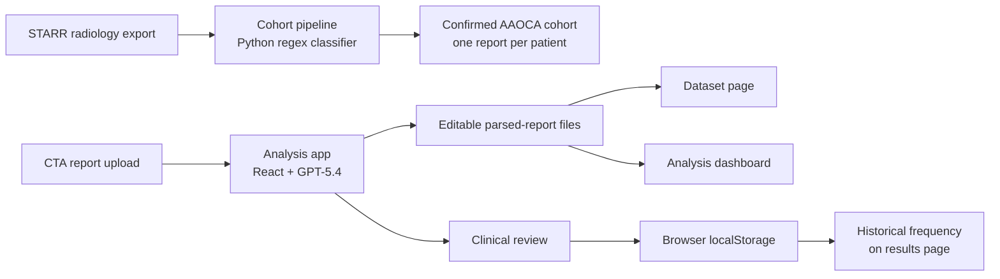
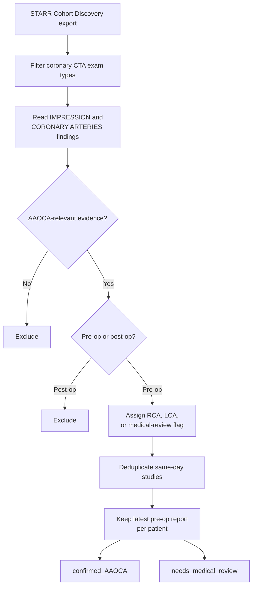
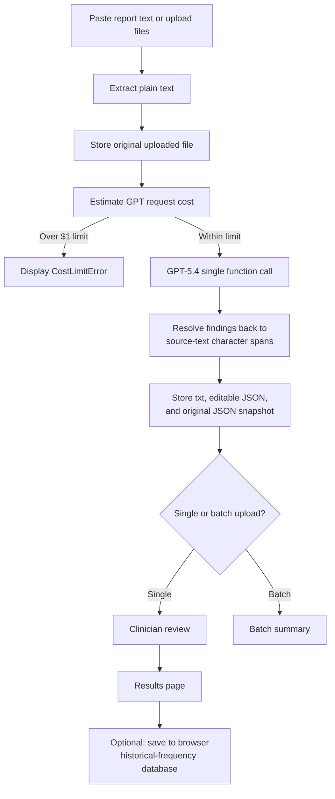

# Coronary Anomaly Analytics

Clinical analytics tooling for pediatric cardiologists studying anomalous aortic origin of a coronary artery (AAOCA) from coronary CT angiogram (CTA) reports.

This repository contains two separate report-processing pipelines:

1. A deterministic Python pipeline for building a research cohort from a bulk STARR radiology export.
2. A React application for extracting, reviewing, storing, and analyzing AAOCA-related findings with an OpenAI GPT parser.

The pipelines solve different problems, run on different stacks, and do not share code. Rules that apply to one pipeline should not be assumed to apply to the other.

## System Overview



## Pipeline 1: AAOCA Cohort Preparation

The Python cohort pipeline lives in [`cohort-pipeline/`](./cohort-pipeline/). It converts a bulk STARR coronary-CTA research export into a parse-ready AAOCA pre-operative cohort with one report per patient.

This pipeline is deterministic. It uses regex classification rather than an LLM.

### Workflow



### Step 0: Define the STARR cohort

In STARR Cohort Discovery, select the coronary-CTA exam types listed in [`cohort_exam_types_final.txt`](./cohort-pipeline/cohort_exam_types_final.txt), then export the CT radiology reports for those patients.

The initial STARR cohort is intentionally broad. AAOCA status is determined downstream by the classifier rather than by a content keyword search. Keyword searches over-select normal reports containing phrases such as "no anomalous origin."

### Step 1: Classify reports

```bash
cd cohort-pipeline
python classify_final.py radiology_report.csv classified_reports.csv
```

[`classify_final.py`](./cohort-pipeline/classify_final.py) performs:

- Coronary-CTA title filtering.
- Negation-aware anomalous-origin detection.
- Pre-operative versus post-operative classification.
- RCA versus LCA laterality assignment.
- Medical-review flagging for ambiguous cases.

The classifier reads only the `IMPRESSION` and `CORONARY ARTERIES` findings when available. It deliberately excludes the referral question and clinical-history text so a suspected diagnosis in the indication cannot create a false positive.

### Step 2: Create the parse-ready cohort

```bash
python preprocess.py radiology_report.csv -o aaoca_preprocessed
```

[`preprocess.py`](./cohort-pipeline/preprocess.py) runs classification end to end, deduplicates same-date studies, removes post-operative reports, selects the latest pre-operative report per patient, and splits clean cases from reports requiring clinician adjudication.

```text
aaoca_preprocessed/
  confirmed_AAOCA/
    reports.jsonl
    manifest.csv
```

Each JSONL record represents one patient:

```json
{
  "patient_id": "...",
  "date": "...",
  "side": "RCA",
  "age": "...",
  "title": "...",
  "text": "..."
}
```

The `needs_medical_review` group is computed but not written by default. It includes bilateral findings, single-coronary cases, generic or unspecified anomalous origins, and pulmonary-artery origins such as ALCAPA or ARCAPA. See [`cohort-pipeline/README.md`](./cohort-pipeline/README.md) for the detailed flag definitions and PHI-handling guidance.

## Pipeline 2: Interactive CTA Analysis App

The React application lives in [`src/`](./src/). It supports interactive and batch report parsing, clinician review, local file-backed storage, and cohort-level visualization.

Unlike the cohort classifier, the app parser reads the complete report. It keeps clinical-history text by design, with prompt-level rules for excluding a narrow set of suspected-diagnosis mentions from extraction.

### User Workflow



### 1. Upload or paste reports

The analyzer accepts:

- Pasted report text.
- Drag-and-drop file uploads.
- File-browser uploads.
- Single-file and multi-file uploads.
- `.txt`, `.pdf`, and `.docx` files.
- Files up to `1 MB` each.

For PDF files, text extraction runs page by page and the UI shows progress. Uploaded source files are stored under `parsed_reports/uploads/` before LLM parsing begins.

### 2. Parse with GPT-5.4

The app uses one OpenAI Responses API request with a forced `record_findings` function call. There is no silent mock-data or dictionary fallback. Missing API keys, cost-limit failures, timeouts, and OpenAI errors are surfaced to the user.

Before each request, the orchestrator estimates the parse cost and rejects requests estimated to exceed `$1.00`.

The parser extracts:

- AAOCA-related pertinent positives and pertinent negatives.
- Exact supporting text spans and normalized feature names.
- Paper-tracked feature metadata.
- Myocardial bridge count, highest grade, vessel, segment, length, and depth.
- Inter-arterial course length measurements.
- Intramural course length measurements.
- Anomalous-left subtypes:
  - Intraconal / intraseptal / subpulmonic left courses.
  - Intramural / inter-arterial left courses.

The full extraction instructions live in [`src/lib/prompts/ctaParser.prompt.ts`](./src/lib/prompts/ctaParser.prompt.ts). The strict function schema lives in [`src/lib/openaiParser.ts`](./src/lib/openaiParser.ts).

### 3. Resolve source-text positions

Every returned finding is mapped back to the original report before it reaches the review UI:

1. Case-insensitive exact substring match.
2. Whitespace-normalized match that tolerates line breaks, tabs, and repeated spaces.

Findings that cannot be located are discarded and logged to the browser console. This prevents the UI from painting highlights at incorrect offsets.

### 4. Review extracted findings

For a single report, the clinician receives a two-column review interface:

- Highlighted original report on the left.
- Extracted-term cards on the right.
- `Keep` and `Skip` actions for each term.
- Bulk accept and reject actions for pending terms.
- Pertinent-positive versus pertinent-negative toggles.
- Text-selection support for manually adding a missed term.
- Parser model, latency, and estimated-cost metadata.

Confirming the review updates the editable parsed JSON and stores the review decisions with timestamps. The initial parser output remains available as an immutable snapshot for later restoration.

### 5. Inspect the results

The results page shows:

- Green highlights for pertinent positives.
- Muted dashed underlines for pertinent negatives.
- A deduplicated feature-frequency panel.
- Historical-frequency tooltips for highlighted terms.

Historical frequency is calculated across reports explicitly saved to the browser database. A feature that has not appeared in that corpus displays `No historical data`.

### Batch Parsing

When multiple files are uploaded, the app parses them sequentially and displays:

- Current-file progress.
- Success and failure counts.
- Parsed-term counts.
- Saved parsed-report IDs.
- Per-file error details.

A failed file does not stop the remaining batch. Batch parsing stores the parsed reports but does not automatically run clinician review or add reports to the browser historical-frequency database.

## Dataset Page

The `/dataset` page browses the local file-backed parsed-report dataset.

Users can:

- View all parsed reports.
- Inspect report IDs, timestamps, review status, and positive/negative counts.
- Preview reports in read-only mode.
- Reopen a report for editing and clinical review.
- Delete reports.
- Restore the editable JSON to the original parser snapshot.

### Parsed-report file layout

```text
parsed_reports/
  uploads/        # Original uploaded files
  txt/            # Extracted plain-text reports
  json/           # Current editable parsed-report JSON
  original_json/  # Original parser snapshots for restore
```

The local file API is implemented as Vite development-server middleware in [`vite.config.ts`](./vite.config.ts).

## Analysis Dashboard

The `/analysis` page reads the file-backed parsed-report dataset and summarizes cohort-level findings.

The headline metric is per-report incidence: a feature counts once per report regardless of how many times it appears in that report.

### Dashboard features

- **Summary cards:** total parsed reports, R-AAOCA reports, and L-AAOCA reports.
- **Laterality filters:** overall, right-sided AAOCA, and left-sided AAOCA.
- **Left-subtype filters:** all left anomalies, intraconal left anomalies, and intramural/inter-arterial left anomalies.
- **Paper-features overview:** the complete tracked AAOCA feature dictionary with category, aliases, tracking role, asserted count, negated count, and total report incidence.
- **Paper-feature category chart:** expandable category-level feature visualization.
- **Coronary-narrowing table:** vessel- and segment-specific normalization of narrowing, stenosis, and compression findings.
- **Course-length histograms:** inter-arterial and intramural length distributions in `5 mm` bins.
- **Myocardial-bridge dashboard:** patient-level bridge-count and highest-grade distributions.
- **Normalized feature table:** synonym-collapsed feature incidence with clinician `Keep` and `Skip` counts, search, sorting, and pagination.

Feature normalization is centralized in [`src/data/featureCanonical.ts`](./src/data/featureCanonical.ts). The paper-tracked feature dictionary lives in [`src/data/paperFeatures.ts`](./src/data/paperFeatures.ts).

## Storage Model

The application intentionally uses two separate storage systems:

| Storage | Purpose | Used by |
| --- | --- | --- |
| `parsed_reports/txt/` | Extracted source text | Dataset page |
| `parsed_reports/json/` | Current editable parsed-report records | Dataset page and analysis dashboard |
| `parsed_reports/original_json/` | Initial parser snapshots | Dataset restore action |
| Browser `localStorage` | User-selected historical-frequency corpus | Single-report results page |

These are not the same database:

- Confirming a clinical review updates `parsed_reports/json/`.
- Clicking `Save to database` on the results page adds that report to the browser `localStorage` corpus.
- The dashboard reads parsed-report files, while result-page historical frequencies read `localStorage`.

As a result, dashboard counts and result-page historical-frequency counts may differ.

## Tech Stack

- React + TypeScript + Vite
- Tailwind CSS + shadcn/ui
- OpenAI GPT-5.4 Responses API function calling
- PDF.js for PDF extraction
- Mammoth for DOCX extraction
- Recharts for dashboard visualizations
- Vite development-server middleware for local parsed-report files
- Browser `localStorage` for the optional historical-frequency corpus
- Python regex classifier for STARR cohort preparation

## Getting Started

### Install and configure the app

```bash
npm install
cp .env.example .env
```

Add the OpenAI API key to `.env`:

```dotenv
VITE_OPENAI_API_KEY=your_key_here
```

Start the development server:

```bash
npm run dev
```

The app is served on port `8080` by default.

## Project Structure

```text
cohort-pipeline/
  classify_final.py              # Deterministic report classifier
  preprocess.py                  # One-report-per-patient cohort preparation
  cohort_exam_types_final.txt    # STARR coronary-CTA exam types

src/
  pages/
    Index.tsx                    # Upload, parsing, review, and results workflow
    Dataset.tsx                  # Parsed-report browser and editor
    Analysis.tsx                 # Cohort analytics dashboard
  components/
    ReportInput.tsx              # Paste, drag-and-drop, and multi-file upload
    TermReview.tsx               # Interactive clinical review UI
    ReportViewer.tsx             # Highlighted results report
    FrequencyPanel.tsx           # Browser-corpus historical frequencies
  lib/
    openaiParser.ts              # GPT-5.4 function call and ParseResult creation
    parsingOrchestrator.ts       # Cost guard and parser wrapper
    positionResolver.ts          # Exact and whitespace-tolerant span matching
    fileParser.ts                # TXT, PDF, and DOCX extraction
    parsedReportStorage.ts       # File-backed parsed-report API client
    reportDatabase.ts            # localStorage historical-frequency corpus
    prompts/
      ctaParser.prompt.ts        # Clinical extraction instructions
  data/
    parseTypes.ts                # Shared parser and review types
    paperFeatures.ts             # Paper-tracked feature dictionary
    featureCanonical.ts          # Dashboard feature normalization
    laterality.ts                # RCA/LCA and anomalous-left classification

parsed_reports/
  uploads/                       # Original uploaded reports
  txt/                           # Extracted source text
  json/                          # Editable parsed reports
  original_json/                 # Original parser snapshots
```

## Design Principles

The UI follows the CS147 HCI design principles documented in [`design-guidelines.md`](./design-guidelines.md):

- Gestalt principles for visual grouping of related findings.
- Norman's conceptual model for the upload, review, and confirmation flow.
- Nielsen's usability heuristics throughout the interface.

## Environment Variables

| Variable | Required | Description |
| --- | --- | --- |
| `VITE_OPENAI_API_KEY` | Yes | OpenAI API key used by the GPT parser |

## Future Work

- Deploy the application on Google Cloud Platform (GCP).
- Replace the local Vite development-server file API with a production backend service.
- Add a direct import workflow for cohort-pipeline JSONL output.