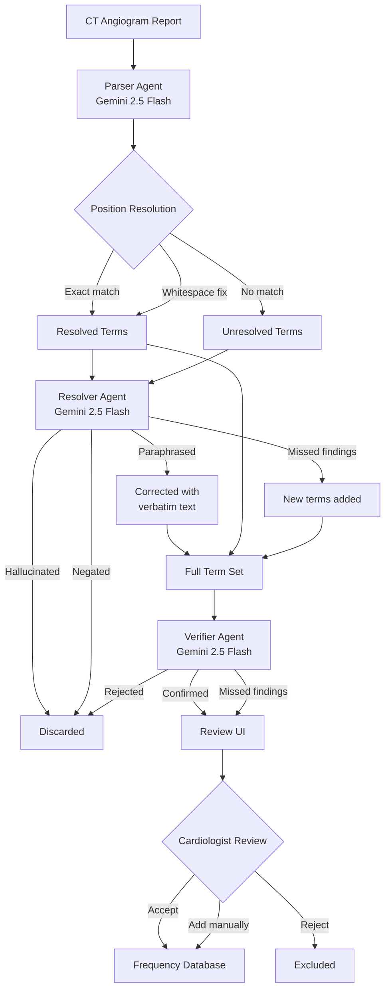

# Coronary Anomaly Analytics

Clinical analytics tool for pediatric cardiologists at Stanford Children's Hospital.

User uploads a CT angiogram  reports, and the system uses LLM-powered named entity recognition to extract, verify, and track the frequence of observed anomalies across a growing database of patients.

## How it works

1. **Upload** a CT angiogram report (paste text or upload PDF)
2. **Parser** (Gemini 2.5 Flash) extracts clinical terms with exact text positions
3. **Resolver** fixes any terms the parser paraphrased instead of quoting verbatim, and catches missed findings
4. **Verifier** confirms or rejects each term (catches negation leaks, hallucinations)
5. **Review UI** — two-column layout: highlighted report on the left, term cards on the right. Cardiologist accepts, rejects, or manually adds terms
6. **Confirmed terms** feed a frequency database tracking anomaly prevalence across reports

### Parsing pipeline



## Tech stack

- React + TypeScript + Vite
- Tailwind CSS + shadcn/ui
- Google Gemini 2.5 Flash API (`@google/generative-ai`)
- MIMIC-IV-Note radiology reports (de-identified)

## Getting started

```bash
# Install dependencies
npm install

# Copy env template and add your Gemini API key
cp .env.example .env
# Edit .env → set VITE_GEMINI_API_KEY=your_key_here

# Start dev server
npm run dev
```

Without an API key the app falls back to mock data for the 3 sample reports.

## Project structure

```
src/
  lib/
    llmParser.ts           # Gemini parser — extracts terms, resolves positions
    llmResolver.ts         # Gemini resolver — fixes unmatched terms, finds missed findings
    llmVerifier.ts         # Gemini verifier — confirms/rejects terms
    parsingOrchestrator.ts # Coordinates parser → resolver → verifier pipeline
  components/
    TermReview.tsx          # Two-column review UI with highlights + term cards
    FrequencyPanel.tsx      # Anomaly frequency bars
  pages/
    Index.tsx               # Upload → parsing → review → results flow
    Dataset.tsx             # Dataset browser (300 MIMIC reports)
  data/
    mockParseResults.ts     # Types + mock data for offline development
    sampleReports.ts        # 3 real MIMIC reports for demo
    anomalyDatabase.ts      # Legacy hardcoded frequency data (to be replaced)
public/
  mimic_reports_300.json    # 300 real MIMIC-IV radiology reports
  seed_reports_10.json      # 10 reports for building the initial parsed database
  test_reports_5.json       # 5 reports for upload/parse testing
  anomaly_frequencies.json  # Legacy frequency data (to be replaced with real parsed results)
scripts/
  mimic_pipeline.py         # Generates mimic_reports_300.json from raw MIMIC data
  generate_sample_pdf.py    # Creates a test PDF from a report not in the dataset
```

## Data pipeline scripts

See [SCRIPTS.md](./SCRIPTS.md) for details on generating the MIMIC dataset and running the NER pipeline.

## Design principles

The UI follows CS147 HCI design principles documented in [design-guidelines.md](./design-guidelines.md):
- Gestalt principles for visual grouping of related findings
- Norman's conceptual model for the upload → review → confirm flow
- Nielsen's 10 usability heuristics throughout the interface

## Environment variables

| Variable | Required | Description |
|----------|----------|-------------|
| `VITE_GEMINI_API_KEY` | Yes (for live parsing) | Google Gemini API key |
| `VITE_ANTHROPIC_API_KEY` | No | Reserved for future use |
| `VITE_OPENAI_API_KEY` | No | Reserved for future use |
