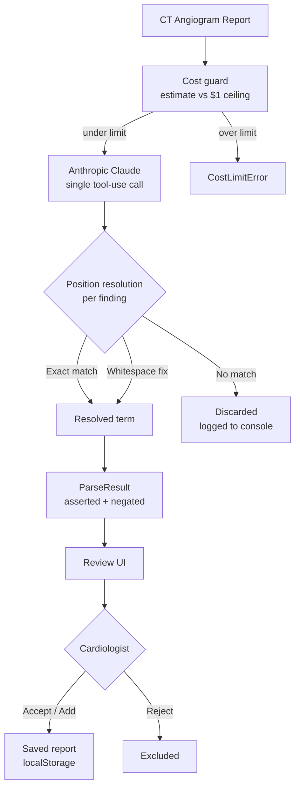

# Coronary Anomaly Analytics

Clinical analytics tool for pediatric cardiologists at Stanford Children's Hospital.

User uploads a CT angiogram report, and the system uses LLM-powered named entity recognition to extract clinical findings (asserted as present and ruled out as negated) and track their frequency across a growing database of patients.

## How it works

1. **Upload** a CT angiogram report (paste text or upload PDF)
2. **Parse** with a single Anthropic Claude tool-use call — extracts clinical terms with exact text positions and asserted/negated status in one shot
3. **Review UI** — two-column layout: highlighted report on the left, term cards on the right. Cardiologist accepts, rejects, or manually adds terms
4. **Save** confirmed terms to a per-browser report database; aggregated counts feed a frequency view

### Parsing pipeline



The legacy 3-call Gemini pipeline (parser → resolver → verifier) and the rule-based dictionary detector were removed — they were either silently masking real LLM failures or duplicating work the single Claude call now does in one pass.

## Tech stack

- React + TypeScript + Vite
- Tailwind CSS + shadcn/ui
- Anthropic Claude (`@anthropic-ai/sdk`) — `claude-sonnet-4-6` via tool-use for forced JSON output
- localStorage for the per-browser saved-report database

## Getting started

```bash
# Install dependencies
npm install

# Copy env template and add your Anthropic API key
cp .env.example .env
# Edit .env → set VITE_ANTHROPIC_API_KEY=your_key_here

# Start dev server
npm run dev
```

If the API key is missing or the call fails, the UI surfaces the error rather than falling back to canned data.

## Project structure

```
src/
  lib/
    anthropicParser.ts      # Single Claude tool-use call → ParseResult
    parsingOrchestrator.ts  # Cost guard + thin wrapper over the parser
    positionResolver.ts     # Exact + whitespace-tolerant span lookup
    reportDatabase.ts       # localStorage-backed saved reports
    fileParser.ts           # PDF / DOCX → text extraction
    prompts/
      anthropicParser.prompt.ts
  components/
    TermReview.tsx          # Two-column review UI with highlights + term cards
    ReportViewer.tsx        # Read-only highlighted report (results stage)
    FrequencyPanel.tsx      # Pertinent positives / negatives frequency bars
  pages/
    Index.tsx               # Upload → parsing → review → results flow
    Dataset.tsx             # Saved-report browser
  data/
    mockParseResults.ts     # ParseResult / ParsedTerm / ReviewableTerm types
    anomalyDatabase.ts      # Static frequency dictionary + DetectedAnomaly type
    sampleReports.ts        # Sample reports for demos
public/
  anomaly_frequencies.json  # Optional override for the static frequency dict
scripts/
  mimic_pipeline.py         # Generates seed datasets from MIMIC raw data
  generate_sample_pdf.py    # Creates a test PDF from a report not in the dataset
```

## Data pipeline scripts

See [SCRIPTS.md](./SCRIPTS.md) for details on generating the seed datasets.

## Design principles

The UI follows CS147 HCI design principles documented in [design-guidelines.md](./design-guidelines.md):
- Gestalt principles for visual grouping of related findings
- Norman's conceptual model for the upload → review → confirm flow
- Nielsen's 10 usability heuristics throughout the interface

## Environment variables

| Variable | Required | Description |
|----------|----------|-------------|
| `VITE_ANTHROPIC_API_KEY` | Yes | Anthropic API key for the Claude parser |
