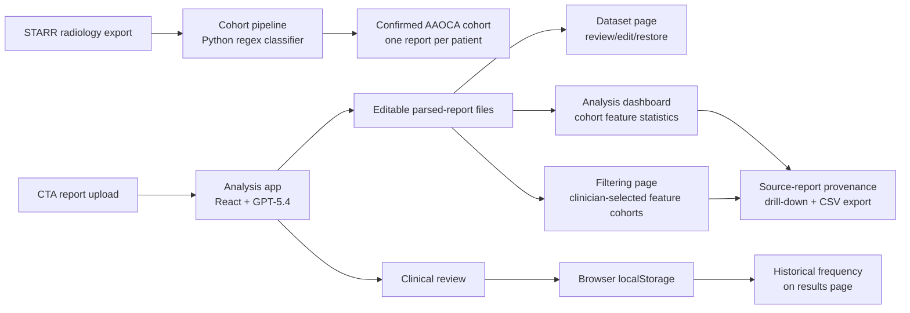
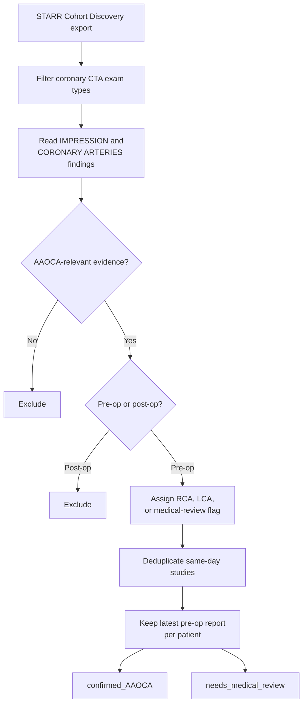
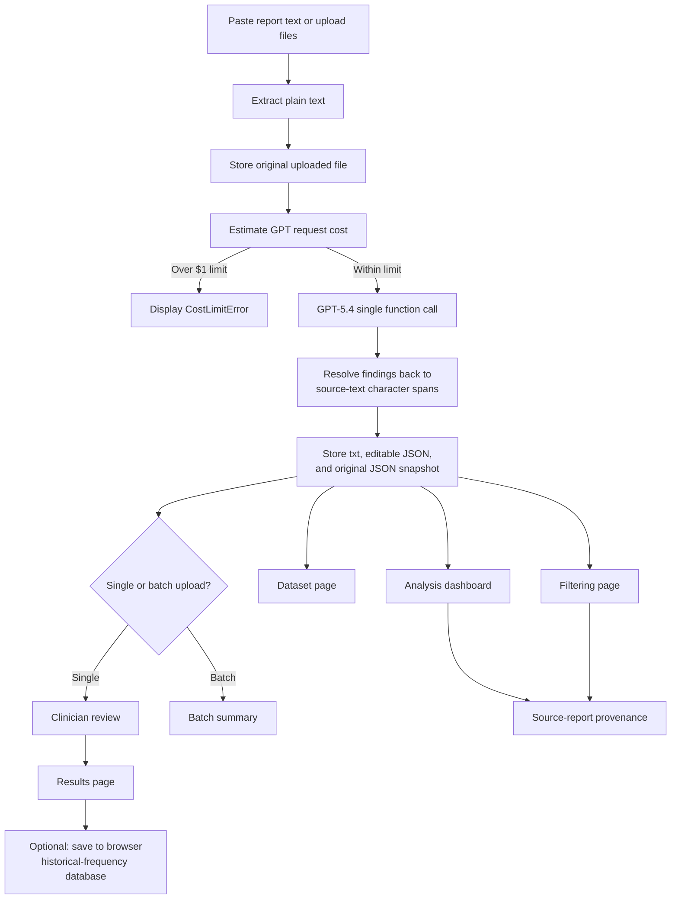

# Coronary Anomaly Analytics

Physician-facing analytics tooling for studying coronary CT angiogram (CTA) reports, with a focus on anomalous aortic origin of a coronary artery (AAOCA).

The current main goal of this project is to help clinicians turn free-text CT reports into a reviewable dataset, then analyze how the features they care about appear across the cohort. The application emphasizes clinician review, feature-level evidence, report-level incidence, filtering, and source-report drill-downs rather than automated diagnosis.

This repository contains two separate report-processing pipelines:

1. A deterministic Python pipeline for building a research cohort from a bulk STARR radiology export.
2. A React application for extracting, reviewing, storing, filtering, and analyzing AAOCA-related findings with an OpenAI GPT parser.

The pipelines solve different problems, run on different stacks, and do not share code. Rules that apply to one pipeline should not be assumed to apply to the other.

## System Overview



## Course Project Documentation

This section maps the repository to the course README requirements.

### Interview Materials

The team met with the clinical team many times throughout the project. Their needs, feedback, and feature suggestions were summarized as GitHub issues in this repository; some have been completed and closed, while others remain open for future work.

Pointers:

- [GitHub Issues: clinical team needs, feedback, and implementation tasks](https://github.com/nino-triandafilidis/coronary-anomaly-analytics/issues)
- [`design-guidelines.md`](./design-guidelines.md) - HCI principles used to guide the clinical interface, including the upload, review, and confirmation flow.

### Code Developed for the Project

The rest of this README documents the code developed for the project: the deterministic cohort-preparation pipeline and the interactive React application for parsing, reviewing, storing, filtering, and analyzing CT reports. Key entry points are listed below.

Core application code:

- [`src/pages/Index.tsx`](./src/pages/Index.tsx) - upload, parse, clinician-review, batch-parse, and single-report results workflow.
- [`src/pages/Dataset.tsx`](./src/pages/Dataset.tsx) - local parsed-report browser, read-only preview, edit/review, restore, and delete actions.
- [`src/pages/Analysis.tsx`](./src/pages/Analysis.tsx) - cohort-level dashboard for report-level feature incidence, risk-feature co-occurrence, course-length histograms, bridge statistics, normalized feature tables, and source-report drill-downs.
- [`src/pages/Filtering.tsx`](./src/pages/Filtering.tsx) - feature-based cohort retrieval and myocardial-bridge profile view.
- [`src/components/TermReview.tsx`](./src/components/TermReview.tsx) - clinician review UI for keeping, skipping, toggling, and manually adding extracted terms.
- [`src/components/ProvenancePanel.tsx`](./src/components/ProvenancePanel.tsx) - source-report evidence panel and CSV export for aggregate counts.

Parsing, storage, and analysis logic:

- [`src/lib/openaiParser.ts`](./src/lib/openaiParser.ts) and [`src/lib/prompts/ctaParser.prompt.ts`](./src/lib/prompts/ctaParser.prompt.ts) - GPT structured-output parser and clinical extraction prompt.
- [`src/lib/parsingOrchestrator.ts`](./src/lib/parsingOrchestrator.ts) - parse wrapper with per-call cost guard and error handling.
- [`src/lib/positionResolver.ts`](./src/lib/positionResolver.ts) - exact and whitespace-tolerant source-span matching.
- [`src/lib/fileParser.ts`](./src/lib/fileParser.ts), [`src/lib/pdfText.ts`](./src/lib/pdfText.ts), and [`src/lib/pdfTextWorker.ts`](./src/lib/pdfTextWorker.ts) - `.txt`, `.pdf`, and `.docx` text extraction support.
- [`src/lib/parsedReportStorage.ts`](./src/lib/parsedReportStorage.ts) and [`vite.config.ts`](./vite.config.ts) - file-backed local parsed-report API.
- [`src/lib/provenance.ts`](./src/lib/provenance.ts) - contributor grouping, report-count helpers, and CSV export for provenance panels.
- [`src/data/paperFeatures.ts`](./src/data/paperFeatures.ts), [`src/data/featureCanonical.ts`](./src/data/featureCanonical.ts), [`src/data/laterality.ts`](./src/data/laterality.ts), [`src/data/riskCooccurrence.ts`](./src/data/riskCooccurrence.ts), [`src/data/filteringFeatures.ts`](./src/data/filteringFeatures.ts), and [`src/data/bridgeProfile.ts`](./src/data/bridgeProfile.ts) - feature dictionaries, normalization, laterality classification, risk co-occurrence, filtering, and bridge profiling.

Cohort-preparation code:

- [`cohort-pipeline/classify_final.py`](./cohort-pipeline/classify_final.py) - deterministic coronary-CTA and AAOCA classifier.
- [`cohort-pipeline/preprocess.py`](./cohort-pipeline/preprocess.py) - one-report-per-patient cohort preprocessing.
- [`cohort-pipeline/test_classify_final.py`](./cohort-pipeline/test_classify_final.py) and TypeScript tests under [`src/`](./src/) - unit tests for cohort classification, prompt behavior, entity resolution, laterality, feature normalization, course-length parsing, bridge analysis, and provenance helpers.

### Datasets Used

- **STARR coronary-CTA radiology report export:** CT radiology reports retrieved from STARR (STAnford Research Repository) Tools through Cohort Discovery and Data Delivery. The project used PHI Removed data delivered by STARR. The raw `radiology_report.csv` is intentionally not committed because it still contains clinical report text. The cohort definition and provenance are documented in [`cohort-pipeline/STARR_cohort_definition.md`](./cohort-pipeline/STARR_cohort_definition.md), [`cohort-pipeline/cohort_exam_types_final.txt`](./cohort-pipeline/cohort_exam_types_final.txt), and [`cohort-pipeline/keyword_search_recommendation.md`](./cohort-pipeline/keyword_search_recommendation.md).
- **Preprocessed AAOCA cohort:** generated output from [`cohort-pipeline/preprocess.py`](./cohort-pipeline/preprocess.py), normally under `cohort-pipeline/aaoca_preprocessed/confirmed_AAOCA/` as `reports.jsonl` and `manifest.csv`. These outputs are not committed because they contain report text.
- **Local parsed-report dataset:** reports uploaded or pasted through the React app are stored under `parsed_reports/uploads/`, `parsed_reports/txt/`, `parsed_reports/json/`, and `parsed_reports/original_json/`. This directory is ignored by Git because it may contain clinical report text.
- **In-code sample and test data:** small synthetic/sample fixtures used for development and tests, including [`src/data/sampleReports.ts`](./src/data/sampleReports.ts), [`src/data/resolverGoldenSet.ts`](./src/data/resolverGoldenSet.ts), and test files throughout [`src/data/`](./src/data/) and [`src/lib/`](./src/lib/).
- **Feature knowledge base:** AAOCA feature definitions, aliases, and tracking roles in [`src/data/paperFeatures.ts`](./src/data/paperFeatures.ts). This is a curated feature dictionary used for extraction and analysis, not a patient dataset.

The `.gitignore` excludes `parsed_reports/`, `cohort-pipeline/*.csv`, `cohort-pipeline/*.jsonl`, `cohort-pipeline/aaoca_preprocessed/`, `AAOCA CTA Report Copies/`, and other confidential data locations.

### Data Processing and Statistical Methods

Data processing methods:

- In STARR Cohort Discovery, the team selected CT report documents and used AAOCA-related search keywords to retrieve CT reports relevant to anomalous coronary anatomy.
- STARR cohort selection also uses a curated coronary-CTA exam-type list, documented in [`cohort-pipeline/cohort_exam_types_final.txt`](./cohort-pipeline/cohort_exam_types_final.txt).
- The Python cohort pipeline applies coronary-CTA title filtering, negation-aware anomalous-origin detection, pre-operative versus post-operative classification, RCA/LCA laterality assignment, same-day deduplication, and latest pre-operative report selection.
- The React app extracts text from `.txt`, `.pdf`, and `.docx` files, stores original uploads, parses report text with a forced GPT function call, and resolves each extracted finding back to a source-text character span before clinician review.
- Clinician review decisions update the editable parsed-report JSON while preserving the original parser snapshot for restore.
- Feature normalization collapses synonyms and vessel/segment-specific variants before dashboard counting.

Statistical and descriptive analysis methods:

- Per-report incidence is the primary count: a feature counts once per report, regardless of repeated mentions.
- Counts are split by assertion status (`asserted` versus `negated`) where clinically useful.
- Laterality filters summarize overall, R-AAOCA, L-AAOCA, and anomalous-left subtypes.
- Risk-feature co-occurrence counts report-level pairs among R-AAOCA risk features and displays L-AAOCA prevalence as a control comparison.
- Inter-arterial and intramural course lengths are normalized to millimeters, binned in `5 mm` intervals, and summarized with mean, median, and standard deviation.
- Myocardial bridge analysis summarizes patient-level bridge count, highest grade, grade distribution, length buckets, and count-by-grade matrices.
- Provenance drill-downs show the source reports and text snippets behind aggregate counts, with CSV export for downstream review.

No inferential statistical testing, regression modeling, or outcome prediction is currently implemented.

### Modeling and Theory Work

- The project uses GPT-5.4 through the OpenAI Responses API as a structured information-extraction model. The model is forced to call `record_findings`, producing a strict schema consumed by the review and analysis UI.
- The extraction theory is feature-based clinical information extraction: findings are represented as normalized names, assertion status, exact supporting text, paper-feature metadata, and source offsets.
- The analysis theory is report-level cohort analytics rather than diagnosis automation. The dashboard asks how often clinician-relevant features occur, how risk features co-occur, and which source reports support each count.
- Laterality and anomalous-left subtype logic encode clinical assumptions about RCA/LCA origin and course categories in [`src/data/laterality.ts`](./src/data/laterality.ts) and [`src/data/anomalousLeftSubtypes.ts`](./src/data/anomalousLeftSubtypes.ts).
- The UI design follows HCI principles from [`design-guidelines.md`](./design-guidelines.md): Gestalt grouping, Norman's conceptual model, Nielsen heuristics, visible system status, error recovery, and clinician-in-the-loop confirmation.
- There is no supervised machine-learning model trained in this repository. The deterministic cohort classifier and feature-normalization utilities are rule-based.

### Challenges Faced

- **Keyword recall versus precision:** broad keyword searches catch more AAOCA cases but also pull normal reports with phrases such as "no anomalous origin"; the project handles this with downstream classification and review.
- **Negation and suspected diagnoses:** the system must distinguish asserted findings from negated findings and avoid treating referral-history suspicion as confirmed anatomy.
- **Source-text grounding:** LLM outputs are only useful for review if every finding can be traced back to the exact report span; unresolvable findings are discarded rather than highlighted incorrectly.
- **Variable radiology language:** the same clinical feature can appear through many synonyms, vessel names, segment names, and measurement formats, requiring normalization and curated feature dictionaries.
- **Clinical ambiguity:** bilateral findings, single-coronary cases, generic anomalous origins, post-operative reports, and pulmonary-artery origins need special handling or clinician adjudication.
- **Cost and reliability of LLM parsing:** the app includes a per-request cost guard, timeout handling, and explicit error surfacing instead of silent mock or dictionary fallback.


## Pipeline 1: AAOCA Cohort Preparation

The Python cohort pipeline lives in [`cohort-pipeline/`](./cohort-pipeline/). It converts a bulk STARR coronary-CTA research export into a parse-ready AAOCA pre-operative cohort with one report per patient.

This pipeline is deterministic. It uses regex classification rather than an LLM.

### Workflow



### Step 0: Define the STARR cohort

In STARR Cohort Discovery, select the coronary-CTA exam types listed in [`cohort_exam_types_final.txt`](./cohort-pipeline/cohort_exam_types_final.txt), then export the CT radiology reports for those patients.

The initial STARR cohort is intentionally broad. AAOCA status is determined downstream by the classifier rather than by a content keyword search. Keyword searches over-select normal reports containing phrases such as "no anomalous origin."

### Step 1: Classify reports

```bash
cd cohort-pipeline
python classify_final.py radiology_report.csv classified_reports.csv
```

[`classify_final.py`](./cohort-pipeline/classify_final.py) performs:

- Coronary-CTA title filtering.
- Negation-aware anomalous-origin detection.
- Pre-operative versus post-operative classification.
- RCA versus LCA laterality assignment.
- Medical-review flagging for ambiguous cases.

The classifier reads only the `IMPRESSION` and `CORONARY ARTERIES` findings when available. It deliberately excludes the referral question and clinical-history text so a suspected diagnosis in the indication cannot create a false positive.

### Step 2: Create the parse-ready cohort

```bash
python preprocess.py radiology_report.csv -o aaoca_preprocessed
```

[`preprocess.py`](./cohort-pipeline/preprocess.py) runs classification end to end, deduplicates same-date studies, removes post-operative reports, selects the latest pre-operative report per patient, and splits clean cases from reports requiring clinician adjudication.

```text
aaoca_preprocessed/
  confirmed_AAOCA/
    reports.jsonl
    manifest.csv
```

Each JSONL record represents one patient:

```json
{
  "patient_id": "...",
  "date": "...",
  "side": "RCA",
  "age": "...",
  "title": "...",
  "text": "..."
}
```

The `needs_medical_review` group is computed but not written by default. It includes bilateral findings, single-coronary cases, generic or unspecified anomalous origins, and pulmonary-artery origins such as ALCAPA or ARCAPA. See [`cohort-pipeline/README.md`](./cohort-pipeline/README.md) for the detailed flag definitions and PHI-handling guidance.

## Pipeline 2: Interactive CTA Feature Analysis App

The React application lives in [`src/`](./src/). It supports interactive and batch report parsing, clinician review, local file-backed storage, and cohort-level visualization.

Unlike the cohort classifier, the app parser reads the complete report. It keeps clinical-history text by design, with prompt-level rules for excluding a narrow set of suspected-diagnosis mentions from extraction.

This app is the current product focus. It is designed around a clinical analysis loop:

1. Convert CT report text into structured findings.
2. Let a clinician keep, skip, or add extracted terms.
3. Store the reviewed report as local text and JSON.
4. Analyze report-level feature incidence across the cohort.
5. Filter the cohort by clinician-selected features and inspect the source evidence behind each count.

### User Workflow



### 1. Upload or paste reports

The analyzer accepts:

- Pasted report text.
- Drag-and-drop file uploads.
- File-browser uploads.
- Single-file and multi-file uploads.
- `.txt`, `.pdf`, and `.docx` files.
- Files up to `1 MB` each.

For PDF files, text extraction runs page by page and the UI shows progress. Uploaded source files are stored under `parsed_reports/uploads/` before LLM parsing begins.

### 2. Parse with GPT-5.4

The app uses one OpenAI Responses API request with a forced `record_findings` function call. There is no silent mock-data or dictionary fallback. Missing API keys, cost-limit failures, timeouts, and OpenAI errors are surfaced to the user.

Before each request, the orchestrator estimates the parse cost and rejects requests estimated to exceed `$1.00`.

The parser extracts:

- AAOCA-related pertinent positives and pertinent negatives.
- Exact supporting text spans and normalized feature names.
- Paper-tracked feature metadata.
- Myocardial bridge count, highest grade, vessel, segment, length, and depth.
- Inter-arterial course length measurements.
- Intramural course length measurements.
- Anomalous-left subtypes:
  - Intraconal / intraseptal / subpulmonic left courses.
  - Intramural / inter-arterial left courses.

The full extraction instructions live in [`src/lib/prompts/ctaParser.prompt.ts`](./src/lib/prompts/ctaParser.prompt.ts). The strict function schema lives in [`src/lib/openaiParser.ts`](./src/lib/openaiParser.ts).

### 3. Resolve source-text positions

Every returned finding is mapped back to the original report before it reaches the review UI:

1. Case-insensitive exact substring match.
2. Whitespace-normalized match that tolerates line breaks, tabs, and repeated spaces.

Findings that cannot be located are discarded and logged to the browser console. This prevents the UI from painting highlights at incorrect offsets.

### 4. Review extracted findings

For a single report, the clinician receives a two-column review interface:

- Highlighted original report on the left.
- Extracted-term cards on the right.
- `Keep` and `Skip` actions for each term.
- Bulk accept and reject actions for pending terms.
- Pertinent-positive versus pertinent-negative toggles.
- Text-selection support for manually adding a missed term.
- Parser model, latency, and estimated-cost metadata.

Confirming the review updates the editable parsed JSON and stores the review decisions with timestamps. The initial parser output remains available as an immutable snapshot for later restoration.

### 5. Inspect the results

The results page shows:

- Green highlights for pertinent positives.
- Muted dashed underlines for pertinent negatives.
- A deduplicated feature-frequency panel.
- Historical-frequency tooltips for highlighted terms.

Historical frequency is calculated across reports explicitly saved to the browser database. A feature that has not appeared in that corpus displays `No historical data`.

### Batch Parsing

When multiple files are uploaded, the app parses them sequentially and displays:

- Current-file progress.
- Success and failure counts.
- Parsed-term counts.
- Saved parsed-report IDs.
- Per-file error details.

A failed file does not stop the remaining batch. Batch parsing stores the parsed reports but does not automatically run clinician review or add reports to the browser historical-frequency database.

## Dataset Page

The `/dataset` page browses the local file-backed parsed-report dataset.

Users can:

- View all parsed reports.
- Inspect report IDs, timestamps, review status, and positive/negative counts.
- Preview reports in read-only mode.
- Reopen a report for editing and clinical review.
- Delete reports.
- Restore the editable JSON to the original parser snapshot.

### Parsed-report file layout

```text
parsed_reports/
  uploads/        # Original uploaded files
  txt/            # Extracted plain-text reports
  json/           # Current editable parsed-report JSON
  original_json/  # Original parser snapshots for restore
```

The local file API is implemented as Vite development-server middleware in [`vite.config.ts`](./vite.config.ts).

## Analysis Dashboard

The `/analysis` page reads the file-backed parsed-report dataset and summarizes cohort-level findings.

The headline metric is per-report incidence: a feature counts once per report regardless of how many times it appears in that report.

Most aggregate counts are clickable. Clicking a count, bar, matrix cell, or category opens a source-report panel showing the contributing reports, matched wording, surrounding context, assertion side, and a link back into the dataset preview. The panel can export the visible contributors as CSV.

### Dashboard features

- **Summary cards:** total parsed reports, R-AAOCA reports, and L-AAOCA reports.
- **Laterality filters:** overall, right-sided AAOCA, and left-sided AAOCA.
- **Left-subtype filters:** all left anomalies, intraconal left anomalies, and intramural/inter-arterial left anomalies.
- **Paper-features overview:** the complete tracked AAOCA feature dictionary with category, aliases, tracking role, asserted count, negated count, and total report incidence.
- **Paper-feature category chart:** expandable category-level feature visualization.
- **Origin and risk co-occurrence:** R-AAOCA risk-feature matrix for opposite sinus, inter-arterial course, intramural course, slit-like ostium, high origin, acute takeoff, and significant narrowing, with L-AAOCA shown as a control prevalence column.
- **Coronary-narrowing table:** vessel- and segment-specific normalization of narrowing, stenosis, and compression findings.
- **Course-length histograms:** inter-arterial and intramural length distributions in `5 mm` bins, including summary statistics.
- **Myocardial-bridge dashboard:** patient-level bridge-count distribution, highest-grade distribution, and bridge count by highest-grade matrix.
- **Normalized feature table:** synonym-collapsed feature incidence with clinician `Keep` and `Skip` counts, search, sorting, and pagination.
- **Provenance drill-down:** source snippets grouped by phrasing, asserted/negated tabs when relevant, report search, dataset deep links, and CSV export.

Feature normalization is centralized in [`src/data/featureCanonical.ts`](./src/data/featureCanonical.ts). The paper-tracked feature dictionary lives in [`src/data/paperFeatures.ts`](./src/data/paperFeatures.ts).

Risk co-occurrence logic lives in [`src/data/riskCooccurrence.ts`](./src/data/riskCooccurrence.ts). Provenance grouping and CSV generation live in [`src/lib/provenance.ts`](./src/lib/provenance.ts).

## Feature Filtering Page

The `/filtering` page lets clinicians retrieve and profile reports that match features of interest. It reads the same local parsed-report dataset as the analysis dashboard.

Users can:

- Select the cohort scope: overall, right-sided AAOCA, or left-sided AAOCA.
- Choose risk-feature filters such as inter-arterial course, intramural course, slit-like ostium, high origin, acute takeoff, and significant narrowing.
- Add myocardial-bridge filters by grade and length bucket.
- Use **Filter: Single** mode to retrieve reports containing every selected feature.
- Use **Filter: Multi** mode to compare all observed feature combinations among the selected features.
- Use **Bridge Profile** mode to summarize myocardial bridge grade by length for the filtered cohort.
- Preview matched reports, highlighted evidence, and searchable report text.

Filtering feature definitions are centralized in [`src/data/filteringFeatures.ts`](./src/data/filteringFeatures.ts). Bridge profile bucketing lives in [`src/data/bridgeProfile.ts`](./src/data/bridgeProfile.ts).

## Storage Model

The application intentionally uses two separate storage systems:

| Storage | Purpose | Used by |
| --- | --- | --- |
| `parsed_reports/txt/` | Extracted source text | Dataset page |
| `parsed_reports/json/` | Current editable parsed-report records | Dataset page, analysis dashboard, and filtering page |
| `parsed_reports/original_json/` | Initial parser snapshots | Dataset restore action |
| Browser `localStorage` | User-selected historical-frequency corpus | Single-report results page |

These are not the same database:

- Confirming a clinical review updates `parsed_reports/json/`.
- Clicking `Save to database` on the results page adds that report to the browser `localStorage` corpus.
- The dashboard and filtering page read parsed-report files, while result-page historical frequencies read `localStorage`.

As a result, dashboard counts and result-page historical-frequency counts may differ.

## Tech Stack

- React + TypeScript + Vite
- Tailwind CSS + shadcn/ui
- OpenAI GPT-5.4 Responses API function calling
- PDF.js for PDF extraction
- Mammoth for DOCX extraction
- Recharts for dashboard visualizations
- Vite development-server middleware for local parsed-report files
- Browser `localStorage` for the optional historical-frequency corpus
- Python regex classifier for STARR cohort preparation
- Vitest for parser, resolver, and feature-normalization tests

## Getting Started

### Install and configure the app

```bash
npm install
cp .env.example .env
```

Add the OpenAI API key to `.env`:

```dotenv
VITE_OPENAI_API_KEY=your_key_here
```

Start the development server:

```bash
npm run dev
```

The app is served on port `8080` by default.

Primary routes:

- `/` - upload, parse, review, and single-report results.
- `/dataset` - browse, preview, edit, restore, and delete stored parsed reports.
- `/analysis` - cohort-level feature statistics and provenance drill-down.
- `/filtering` - clinician-selected feature filtering and bridge profiling.

## Project Structure

```text
cohort-pipeline/
  classify_final.py              # Deterministic report classifier
  preprocess.py                  # One-report-per-patient cohort preparation
  cohort_exam_types_final.txt    # STARR coronary-CTA exam types

src/
  pages/
    Index.tsx                    # Upload, parsing, review, and results workflow
    Dataset.tsx                  # Parsed-report browser and editor
    Analysis.tsx                 # Cohort analytics dashboard
    Filtering.tsx                # Clinician-selected feature filtering and bridge profiling
  components/
    ReportInput.tsx              # Paste, drag-and-drop, and multi-file upload
    TermReview.tsx               # Interactive clinical review UI
    ReportViewer.tsx             # Highlighted results report
    FrequencyPanel.tsx           # Browser-corpus historical frequencies
    ProvenancePanel.tsx          # Source-report drill-down and CSV export
  lib/
    openaiParser.ts              # GPT-5.4 function call and ParseResult creation
    parsingOrchestrator.ts       # Cost guard and parser wrapper
    positionResolver.ts          # Exact and whitespace-tolerant span matching
    fileParser.ts                # TXT, PDF, and DOCX extraction
    parsedReportStorage.ts       # File-backed parsed-report API client
    reportDatabase.ts            # localStorage historical-frequency corpus
    provenance.ts                # Contributor grouping, report counts, and CSV export
    prompts/
      ctaParser.prompt.ts        # Clinical extraction instructions
  data/
    parseTypes.ts                # Shared parser and review types
    paperFeatures.ts             # Paper-tracked feature dictionary
    featureCanonical.ts          # Dashboard feature normalization
    filteringFeatures.ts         # Feature definitions for the filtering page
    riskCooccurrence.ts          # Risk-feature detection and co-occurrence counts
    bridgeProfile.ts             # Bridge grade x length profiling
    laterality.ts                # RCA/LCA and anomalous-left classification

parsed_reports/
  uploads/                       # Original uploaded reports
  txt/                           # Extracted source text
  json/                          # Editable parsed reports
  original_json/                 # Original parser snapshots
```

## Design Principles

The UI follows the CS147 HCI design principles documented in [`design-guidelines.md`](./design-guidelines.md):

- Gestalt principles for visual grouping of related findings.
- Norman's conceptual model for the upload, review, and confirmation flow.
- Nielsen's usability heuristics throughout the interface.

## Environment Variables

| Variable | Required | Description |
| --- | --- | --- |
| `VITE_OPENAI_API_KEY` | Yes | OpenAI API key used by the GPT parser |

## Future Work

- Deploy the application on Google Cloud Platform (GCP).
- Replace the local Vite development-server file API with a production backend service.
- Add a direct import workflow for cohort-pipeline JSONL output.
